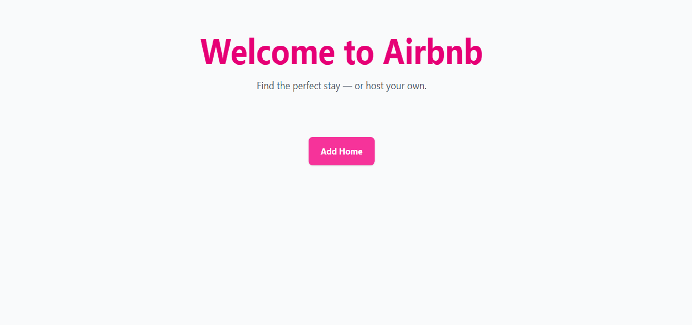
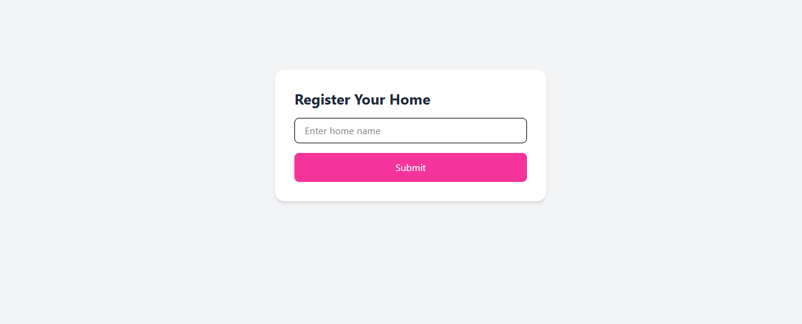
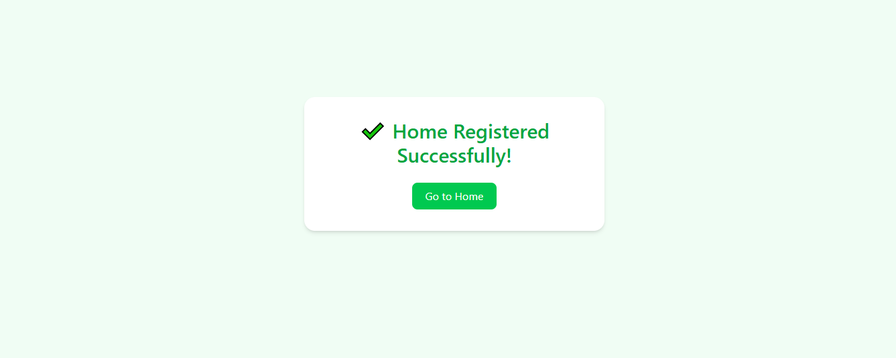

# 🎨 04-airbnb-styling

This project builds on the previously created 02-airbnb-backend and adds UI styling using Tailwind CSS.A small Express.js + Tailwind CSS practice project to learn setting up Tailwind CLI, serving static files, and building a simple styled Airbnb-like UI.

## 📌 Practice Project Description

1. Reused the existing airbnb-backend Express setup.
2. Installed and configured Tailwind CSS using the latest Tailwind CLI.
3. Created a public/ folder to serve static assets (CSS, images).
4. Designed a simple UI using Tailwind utility classes.
5. Used Tailwind’s input.css → output.css workflow with watch mode.

## ✨ Features

- Tailwind CSS setup using the updated 2026 CLI
- Proper folder structure with a public/ directory
- Express.js static file serving
- Utility-first styling using Tailwind
- Beginner-friendly, clean design approach
- Fast development workflow using tailwindcss --watch

## 🖼️ Screenshot Preview

### 🔹 Home Page  

### 🔹 Add Home Page  

### 🔹 Success Page  
