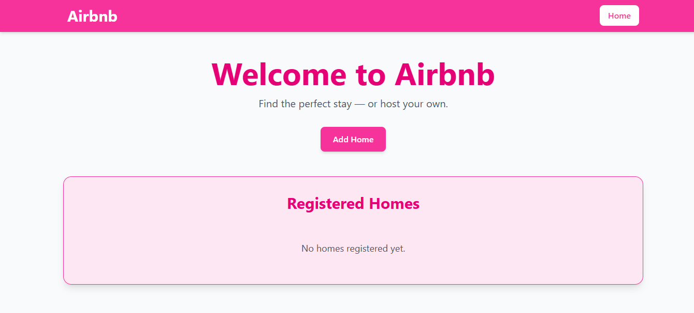
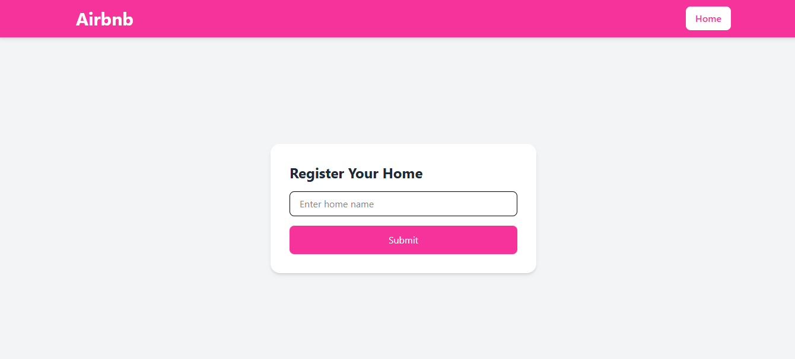
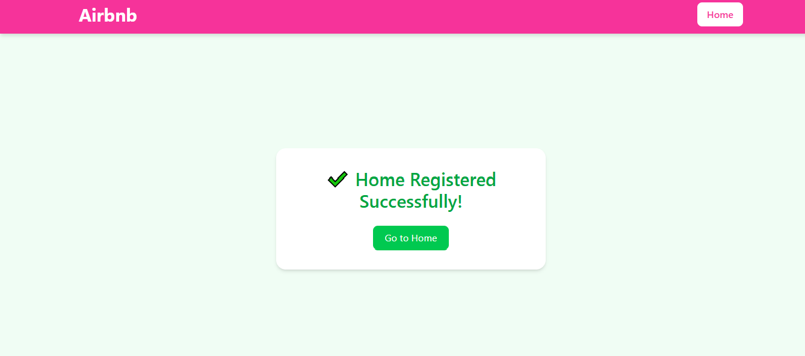
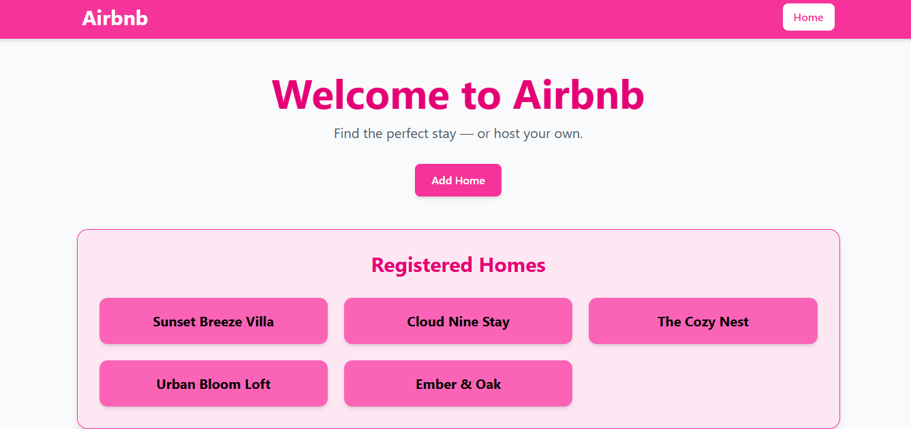

# 🏡 05-dynamic-ui-ejs

A simple Express.js, EJS, and Tailwind CSS practice project built on the previous Airbnb backend application. This project focuses on server-side rendering, reusable layouts using EJS partials, dynamic UI generation, and displaying registered homes dynamically.

## 📌 Practice Project Description

1. Converted static HTML pages into EJS templates.
2. Configured EJS as the view engine in Express.
3. Learned server-side rendering using `res.render()`.
4. Created reusable EJS partials for common UI sections.
5. Added a shared navigation bar component.
6. Rendered dynamic data from the server to the frontend.
7. Used EJS conditionals to handle empty and populated states.
8. Used EJS loops to display registered homes dynamically.
9. Organized views and partials for better maintainability.
10. Continued building the Airbnb practice application using a modular approach.

## ✨ Features

- Express.js with EJS templating
- Server-side rendered pages
- Dynamic rendering using `res.render()`
- Reusable EJS partials
- Shared navigation bar component
- Conditional rendering using EJS
- Looping through data using EJS
- Dynamic Registered Homes section
- Clean project structure
- Beginner-friendly implementation
- Tailwind CSS integration

## 📚 Concepts Practiced

- View Engines
- EJS Templates
- EJS Partials
- `res.render()`
- Dynamic Data Passing
- Conditional Rendering
- Iteration with EJS
- Express Routing
- Modular Application Structure

## 🖼️ Screenshot Preview

### 🔹 Home Page

### 🔹 Add Home Page

### 🔹 Success Page

### 🔹 Registered Homes Preview

## 🚀 Learning Outcome

This project helped me understand how Express.js works with EJS for server-side rendering, how to build reusable layouts using partials, pass data from the backend to templates, render dynamic content using loops and conditionals, and organize a growing Express application into a maintainable structure.