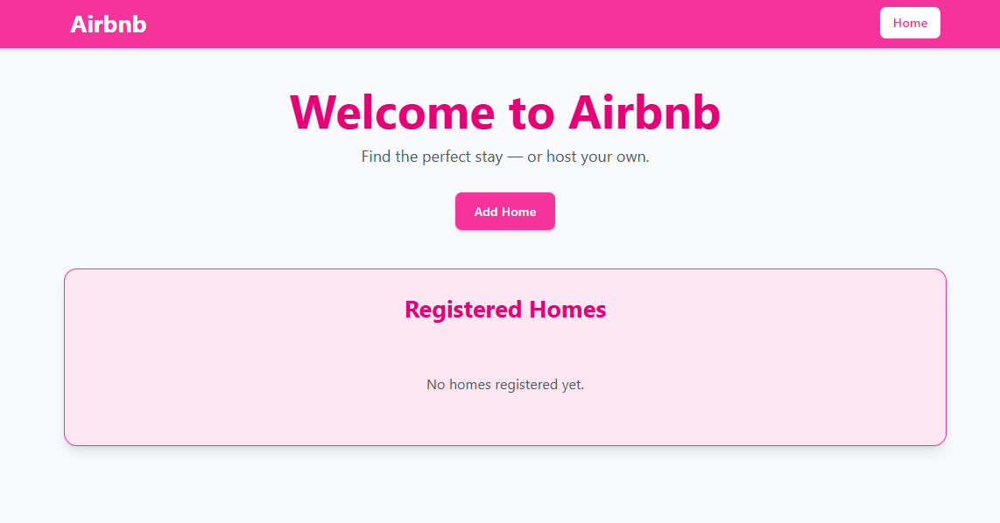
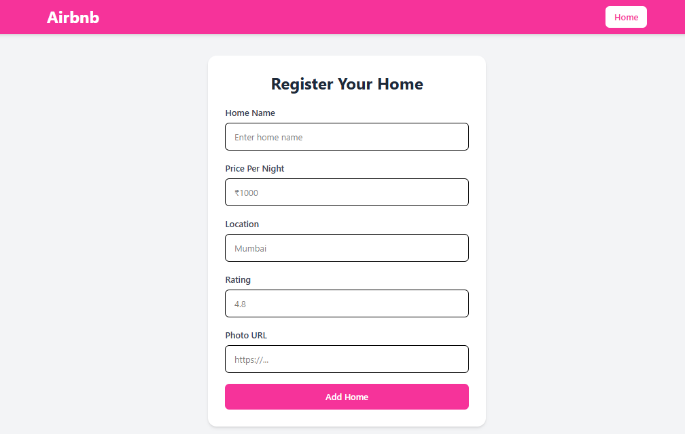
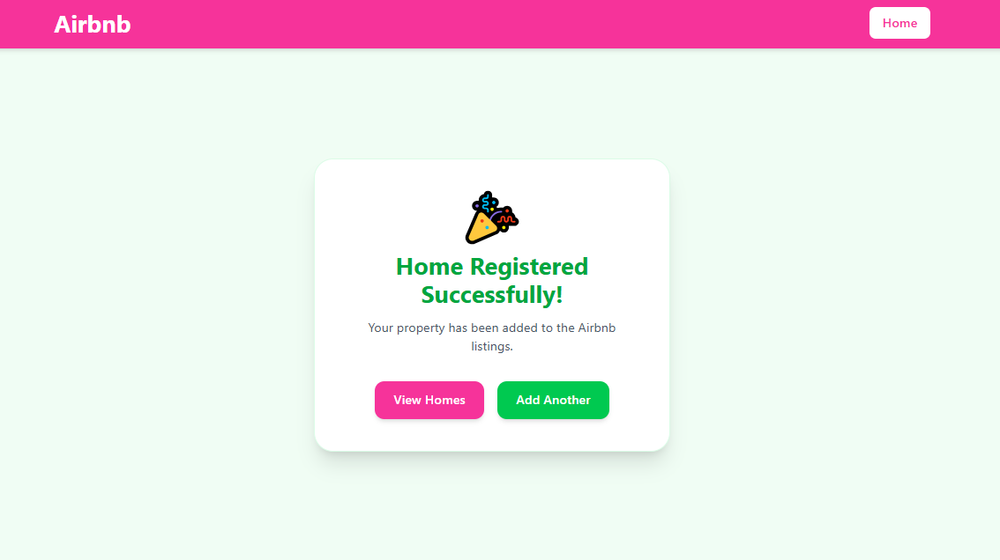
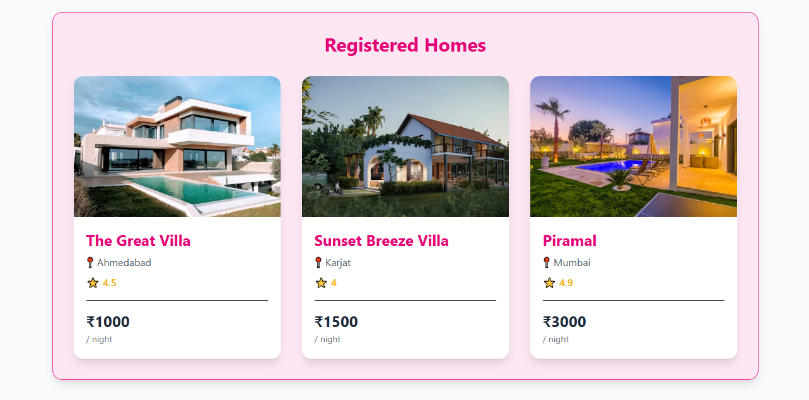
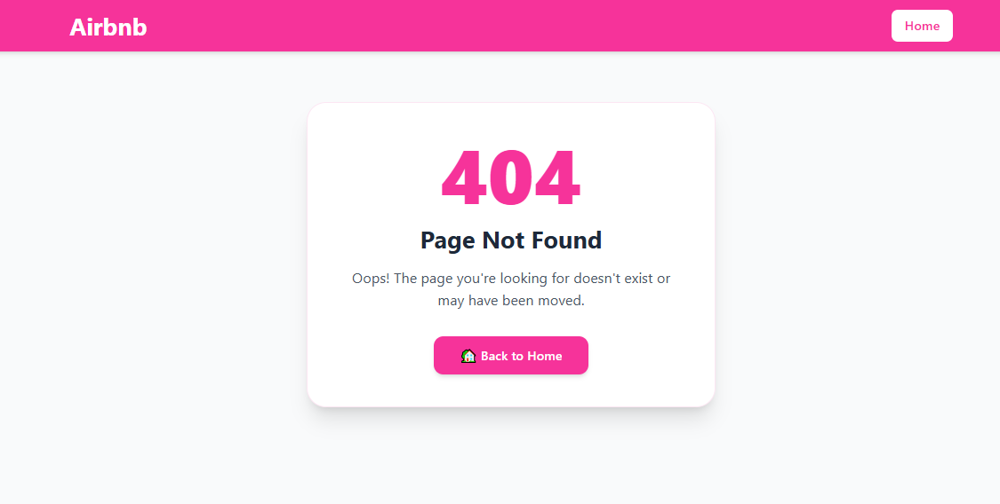

# 🏡 07-airbnb-mvc

A mini Airbnb-inspired listing application built using **Node.js, Express.js, EJS, and Tailwind CSS** following the **MVC (Model–View–Controller)** architecture.

This project is a continuation of the **06-airbnb-listings** project. While the previous version focused on building dynamic pages with EJS and Express, this project restructures the application using the MVC pattern and introduces file-based data persistence using Node.js' File System (`fs`) module.

---

## 📌 What I Learned

### 🏗️ MVC Architecture

Implemented the **Model–View–Controller (MVC)** design pattern by separating application responsibilities into:

- **Models** – Handle application data and business logic.
- **Views** – Render dynamic pages using EJS templates.
- **Controllers** – Process requests, interact with models, and render views.

This improves code organization, readability, and scalability.

---

### 🎮 Controllers

Moved business logic from route files into dedicated controller files.

Controllers now handle:

- Rendering application pages
- Processing form submissions
- Fetching registered homes
- Passing dynamic data to views

---

### 📦 Models

Created a `Home` model to manage Airbnb listings.

Implemented:

- Constructor for creating home objects
- `save()` method to store listings
- `fetchAll()` method to retrieve stored listings

---

### 💾 File System (`fs`) Module

Learned how to persist application data using Node.js' built-in **File System** module.

Implemented:

- Writing home data to a JSON file
- Reading stored data from the JSON file
- Loading previously added homes when the application restarts

Unlike the previous project, listings are now **persisted** and remain available after server reloads.

---

### 🖥️ Dynamic Server-Side Rendering

Practiced rendering dynamic data using EJS by:

- Passing data from controllers to views
- Displaying registered homes dynamically
- Conditional rendering
- Looping through collections
- Generating listing cards dynamically

---

### 📁 Improved Project Structure

Organized the project into separate folders for better maintainability.

```text
07-airbnb-mvc
│
├── controllers
├── models
├── routes
├── views
│   └── partials
├── public
├── data
├── utils
└── app.js
```

---

## ✨ Features

- 🏠 Register Airbnb-style home listings
- 📄 Display all registered homes
- 💾 Persistent storage using JSON files
- 🧩 MVC Architecture
- 🎨 Dynamic EJS Templates
- ♻️ Reusable EJS Partials
- 📱 Responsive UI with Tailwind CSS
- ✅ Registration Success Page
- ❌ Custom 404 Error Page

---

## 🛠️ Tech Stack

- Node.js
- Express.js
- EJS
- Tailwind CSS
- JavaScript
- HTML5
- Node.js File System (`fs`)

---

## 🖼️ Screenshot Preview

### 🔹 Home Page



### 🔹 Register Home Page



### 🔹 Registration Success Page



### 🔹 Registered Home Card



### 🔹 Custom 404 Page



---

