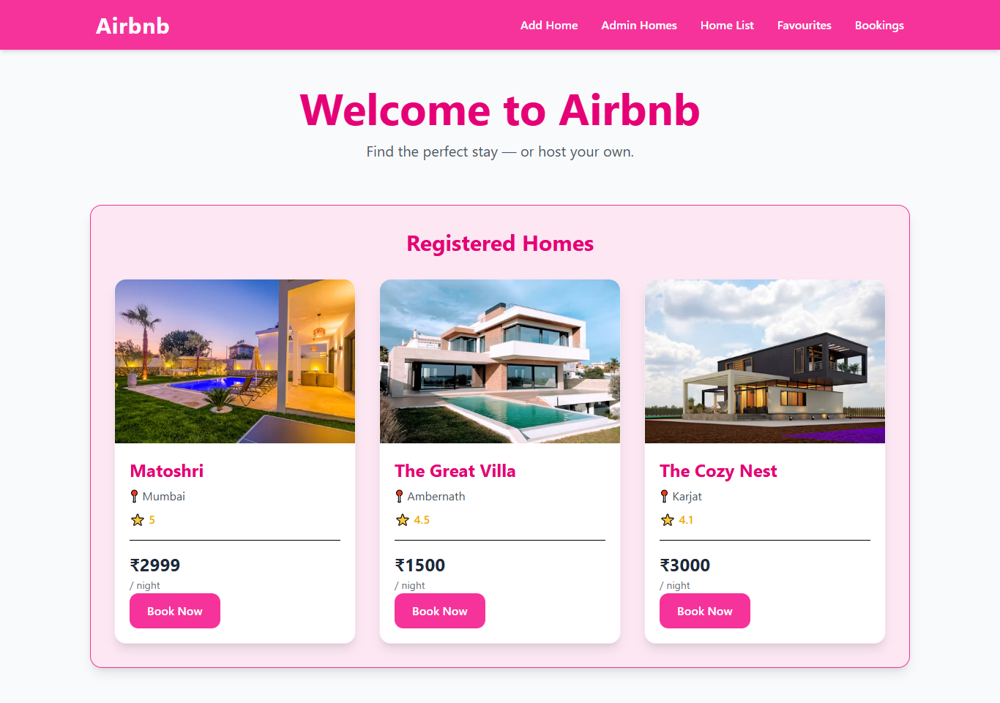
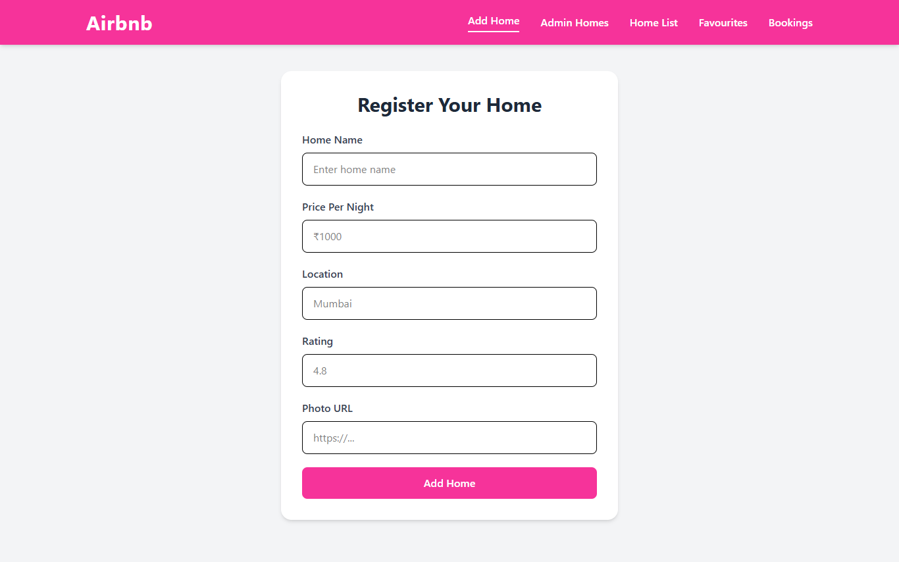
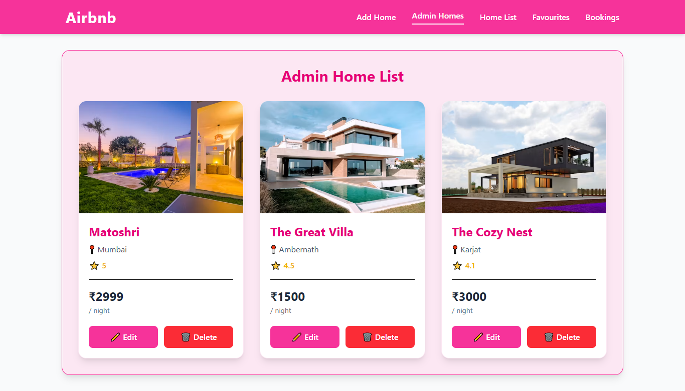
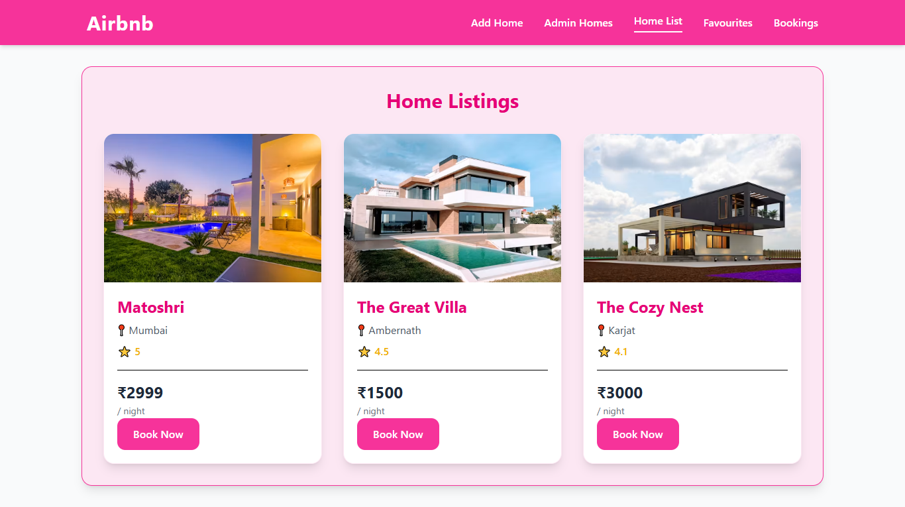
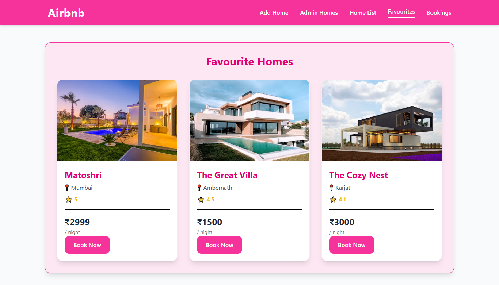
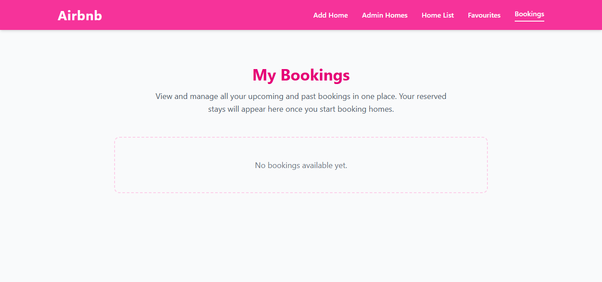

# 🏡 08-airbnb-store-admin

A mini Airbnb-inspired web application built using **Node.js, Express.js, EJS, and Tailwind CSS**, extending the previous MVC project by introducing separate **Store** and **Admin** modules.

This project continues from **07-airbnb-mvc**, focusing on improving application structure by separating user-facing and admin-facing functionalities into dedicated routes, controllers, and views. It also lays the foundation for future CRUD operations.

---

## 📌 What I Learned

### 🏗️ Improved MVC Architecture

Further organized the application by separating responsibilities into:

- **Models** – Manage application data and business logic.
- **Views** – Render dynamic pages using EJS templates.
- **Controllers** – Handle requests and coordinate between models and views.
- **Routes** – Split into Store and Admin modules.

This makes the application easier to maintain and scale.

---

### 🛣️ Modular Routing

Separated application routes into dedicated modules.

#### Store Routes

- Home
- Home List
- Favourite Homes
- Bookings

#### Admin Routes

- Add Home
- Admin Home List

This keeps routing clean and improves project organization.

---

### 🎮 Separate Controllers

Instead of keeping all request handlers together, created dedicated controllers for:

- **Store Controller**
  - Home Page
  - Home List
  - Favourite Homes
  - Bookings

- **Admin Controller**
  - Add Home
  - Save Home
  - Admin Home List

---

### 📁 Better Project Structure

Organized the project into dedicated folders.

```text
08-airbnb-store-admin
│
├── controllers
│   ├── adminController.js
│   ├── storeController.js
│   └── error.js
│
├── models
│   └── home.js
│
├── routes
│   ├── adminRouter.js
│   └── storeRouter.js
│
├── views
│   ├── admin
│   ├── store
│   └── partials
│
├── data
├── public
├── utils
└── app.js
```

---

### 💾 File-Based Data Persistence

Continued using Node.js **File System (`fs`)** module to store application data.

Implemented:

- Reading home listings from a JSON file.
- Writing newly added homes to the JSON file.
- Displaying persisted data after server restarts.

---

### 🖥️ Dynamic Server-Side Rendering

Used EJS templates to dynamically render:

- Home Page
- Home List
- Favourite Homes
- Admin Home List

Practiced:

- Passing data from controllers to views.
- Rendering collections dynamically.
- Conditional rendering.
- Reusable partials.

---

### 🚧 Admin Dashboard Foundation

Created an Admin Home List page that displays all registered homes.

Added UI for:

- ✏️ Edit Home
- 🗑️ Delete Home

> **Note:** Edit and Delete functionality is currently represented with UI elements only. Backend logic will be implemented in future projects.

---

### ❤️ Favourite & 📅 Bookings Pages

Created dedicated pages for:

- Favourite Homes
- Bookings

These pages currently act as placeholders for future functionality while demonstrating modular routing and page organization.

---

## ✨ Features

- 🏡 Add Airbnb-style home listings
- 📋 View all registered homes
- 🛠️ Separate Store and Admin modules
- 📂 Modular routing
- 🎮 Dedicated controllers
- 🧩 MVC Architecture
- 💾 Persistent JSON-based storage
- 🎨 Dynamic EJS templates
- ♻️ Reusable partials
- 📱 Responsive UI using Tailwind CSS
- ✏️ Edit & Delete UI (Coming Soon)
- ❤️ Favourite Homes page
- 📅 Bookings page

---

## 🛠️ Tech Stack

- Node.js
- Express.js
- EJS
- Tailwind CSS
- JavaScript
- HTML5
- Node.js File System (`fs`)

---

## 🖼️ Screenshot Preview

### 🔹 Home Page



---

### 🔹 Add Home Page



---

### 🔹 Admin Home List



---

### 🔹 Home List



---

### 🔹 Favourite Homes



---

### 🔹 Bookings Page



---

## 🚀 Project Progress

This project focuses on improving application architecture by separating the Store and Admin modules while preparing the application for future CRUD functionality.

### ✅ Completed

- MVC Architecture
- Modular Routes
- Store & Admin Controllers
- Dynamic EJS Rendering
- File-Based Data Persistence
- Admin Home Listing
- Favourite & Bookings Pages
- Edit & Delete UI

### 🔜 Coming Next

- Edit Home Functionality
- Delete Home Functionality
- Favourite Logic
- Booking Logic
- Dynamic Home Details
